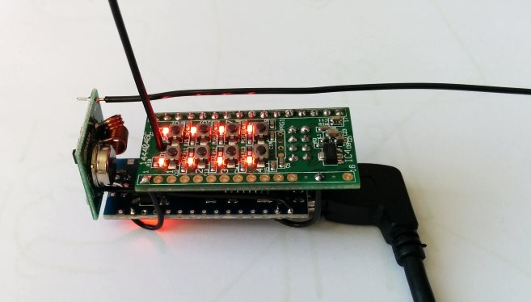

# HomeMatic Funk-Schaltsteckdosen Adapter

Eine Arduino Schaltung und Programmierung um über ein HomeMatic 8-Kanal-Empfangsmodul Funk-Schaltsteckdosen aller Art zu schalten. Die Schaltung und der Code könnte ohne Probleme erweitert werden um einzelne HomeMatic Kanäle anders zu verarbeiten. Das recht teure HomeMatic Empfangsmodul wurde gewählt da die Schaltsteckdosen dadurch letztlich wie HomeMatic Funk-Funksteckdosen auch als Kanal in dem HomeMatic System geschaltet und in Programmen verwendet werden können. 

Das Projekt basiert auf:
* Funk-Schaltsteckdosen
  * bspw. 3er-Set mit Fernbedienung für 10€ in jedem Baumarkt
  * aus diversen Gründen sind Module vom "Typ A" zu empfehlen, [10-fach DIP-Schalter](http://rc-switch.googlecode.com/svn/wiki_images/typeA.png)
* HomeMatic 8-Kanal-Empfangsmodul
  * http://www.elv.de/homematic-8-kanal-empfangsmodul.html
  * ~20€
* Arduino Nano
  * http://arduino.cc/en/Main/ArduinoBoardNano
  * bspw. http://www.ebay.de/itm/301292188973
  * USB-Controller-Treiber für günstigen China-Clone: http://www.5v.ru/ch340g.htm
  * ~4€
* 433 MHz Transmitter
  * bspw. http://www.ebay.de/itm/221652085232
  * rc-switch Bibliothek: http://code.google.com/p/rc-switch
  * ~3€

## Details zum Aufbau
* Homematic PCB ist an den Ausgängen OUT1..OUT8 mit den Pins D2..D9 des Arduino Nano über Pin- und Sockelleisten gekoppelt
* 3V3 und GND sind mit Drähten vom Arduino verlötet
* RF-Modul ist mit 5V und GND am ISCP Header verbunden
* Data-Pin liegt auf D13 (Arduino on-board-LED blinkt beim Senden!) 
* Die Antenne am RF-Modul ist 17cm lang

## Vergleich der Kosten für 8 Schaltsteckdosen

HomeMatic                                 | Projekt
----------------------------------------- | -----------------------
8x Funk-Zwischenstecker-Schaltaktor (40€) | 8x Baumarkt-Steckdosen
                                          | HM Modul (20€)
                                          | Arduino, RF Modul (7€)
**320€**                                  | **60€**
